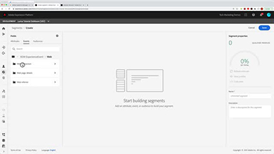

# tutoriais do Audience Manager

Bem-vindo ao site de tutoriais do Audience Manager. A utilização desses tutoriais, juntamente com a [documentação](https://experienceleague.adobe.com/docs/audience-manager/user-guide/aam-home.html?lang=pt-BR), oferece um melhor entendimento de como usar o Adobe Audience Manager para criar e ativar públicos-alvo em qualquer canal ou dispositivo usando o Adobe best-in-class [!DNL data management platform].

* **Escolhas da equipe** destaca alguns de nossos conteúdos favoritos
* Explore o conteúdo por tópico e subtópico na **navegação à esquerda**
* Use o campo **pesquisa** na parte superior da página se você souber o que está procurando

## Escolhas de pessoal

<table>
<tr>
  <td>
    
    

      <a href="https://experienceleague.adobe.com/docs/platform-learn/implement-web-sdk/overview.html?lang=pt-BR">
    <strong>Tutorial sobre Implementação do Adobe Experience Cloud com o SDK da Web</strong>
    </a>
    

    

    <em>Saiba como implementar aplicativos Experience Cloud usando o SDK da Web da Adobe Experience Platform.</em>
    

  </td>
  <td>
    
    

      <a href="https://experienceleague.adobe.com/docs/audience-manager-learn/tutorials/other-integrations/integrating-with-rtcdp/rtcdp-segments-for-aam-users.html?lang=pt-BR">
    <strong>Noções básicas de segmentos na CDP em tempo real para usuários do Audience Manager</strong>
    </a>
    

    

    <em>Este vídeo analisa as diferenças nos segmentos e na criação de segmentos entre o Audience Manager e a Real-time CDP.</em>
    

  </td>
  <td>
    
    

      <a href="https://experienceleague.adobe.com/docs/audience-manager-learn/tutorials/build-and-manage-audiences/algorithmic-models/configure-and-report-on-predictive-audiences.html?lang=pt-BR">
    <strong>Configurar e relatar Predictive Audiences no Audience Manager</strong>
    </a>
    

    

    <em>Neste vídeo, abordaremos a configuração de Predictive Audiences na interface Audience Manager.</em>
    

  </td>
</tr>
</table>

